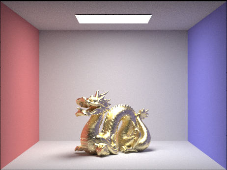
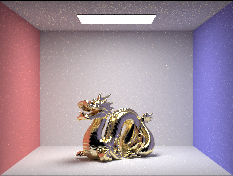

PathTracer
==========

Path tracing simulates the behavior of light by tracing rays through a scene, capturing realistic lighting effects and material interactions. It renders visually accurate images by recursively calculating the color of each pixel based on the paths and interactions of multiple rays. This project is an offline pathtracer I worked on, which was adopted from a class project at UCB. I find it particularly useful while developing the ray tracing portion of my DX12 real-time renderer. This is a summary of the work. 

Implementation Notes:
---

PartA
--- 

<b>Section 1: Ray Generation and Intersection</b>

To begin with, the single pixel ray tracing function is first implemented. Monte Carlo Integration is used to do sampling and calculate radiance. In order to do ray tracing, we must check the intersection between rays and objects. Although a single primitive intersaction is simple, but it is totaly a different story for rendering the whole scene. So accerlation structures woould be highly prefered to filter out some of the rays that would not eventually intersact the primitive. In this project, Bounding Box Hierarchy (BVH) is used to improve performance from O(N) to O(logN). With BVH we can prune many unused branches and only do primitive intersection test at the leaves. Specifically, the splitting point is crucial for our performance. I choose the efficient partition implementation, splitting primitives into 32 buckets and estimate cost by surface area heuristic.

To render correct images, both direct and indirect lightings are required to achieve realism. For direct lighting, an modified diffuse BSDF function is applied for computing the incoming light ratio, and both hemisphere sampling(high variance) and light sampling are implemented.  For indirect lighting, each light ray is traced for multiple bounces before termination. Lastly, adaptive sampling is used for pixel convergence.

<b>Implementation Details</b>

The raytrace_pixel() function takes a pixel at (x,y) in the image space as input and calculates the integral of radiance for that pixel. This is done by repetitively calculating the accumulative spectrum value, which is obtained by adding the radiance of rays generated through random sampling. The ray tracing algorithm is responsible for performing the necessary calculations. It's worth noting that for each ray generated, it's important to normalize the input coordinates by dividing them by the width (w) and height (h) of the image. Once the total spectrum is computed, it needs to be divided by the number of samples (num_samples), and the specific pixel in the sampleBuffer is updated accordingly.

The generate_ray() function produces a ray in the world space, with the input coordinates given in the normalized image space. It performs three key tasks:

It computes the camera space coordinates of the ray's intersection point on the axis-aligned camera sensor.
It retrieves the world space position and normalizes it using the c2w (camera-to-world) rotation matrix.
Finally, it returns the generated ray in the world space.
The Triangle::has_intersection() and Triangle::intersect() functions handle the primitive intersection tests. They check if the ray intersects the plane where the triangle is located. The intersect() function additionally calculates the barycentric coordinates for the surface normal. This involves computing the areas of the sub-triangles (e.g., for vertices A, B, and C, the sub-triangles ABP, ACP, and BCP), as alpha, beta, and gamma are defined by the ratios of these sub-triangles to the original triangle (e.g., alpha = Aa / (Aa + Ab + Ac)).

<b>Section 2: Bounding Volume Hierarchy</b>

This section briefly describes the implementation of the BVH tree construction function and BVH intersection detection function. BVH, which stands for Bounding Volume Hierarchy, is a binary tree structure that helps prune primitives that are guaranteed not to intersect with a given ray. The efficiency and performance of BVH depend on the strategy used to select split points.

In the construct_bvh() function, the primitives are split into 32 buckets along the x, y, and z axes based on their centroids. The split points are chosen by evaluating the cost using the surface area heuristic. This approach is particularly effective when the primitives are not evenly distributed or scattered in the scene.

Following images can be rendered with BVH acceleration much faster compared to the naive approach:

Bench: 67808 primitives

Building: 39506 primitives

For the CBcoil.dae model, the rendering time with BVH acceleration is 0.0881 seconds, whereas without acceleration it takes 79.60 seconds.

Similarly, for the Banana.dae model, the rendering time with BVH acceleration is 0.0612 seconds, while without acceleration it takes 22.85 seconds.

It is evident that the acceleration technique works exceptionally well. In the case of CBcoil.dae, the BVH version is approximately 900 times faster than the naive version! Theoretically, BVH organizes primitives and discards those that are guaranteed to be unnecessary, thereby reducing the time complexity from O(N) to O(logN), which is a significant improvement.

CBcoil: 7884 primitives 0.0881s/79.6s

CBcoil: 2458 primitives 0.0612s/22.85s

<b>Section 3: Direct Illumination</b>

For direct lighting, there are two approaches: **uniform hemisphere sampling** and **importance lights sampling**. For the importance lights sampling, a shadow ray is cast to test whether it's blocked. If it isn't reflection formula is used to find the outgoing light. Note that if the light source is a point light source, the inner loop only runs once to avoid unnecessary calculation.

Renders:

(figure1) importance lighting sampling

(figure2) uniform hemisphere sampling

(figure3) importance lighting sampling

(figure4) uniform hemisphere sampling

For the following render results, the light rays are 1, 4, 16 and 64 with 1 sample per pixel using light sampling. We can observe that the noise(variance) is significantly decreased with increasing number of samples per area light.

lighting sampling : l=1

lighting sampling : l=4

lighting sampling : l=16

lighting sampling : l=64

Comparing the results from uniform hemisphere sampling (figure 2,4) and importance lighting sampling (figure 1,3), we observe that the uniform hemisphere sampling introduces more noise. This is due to the fact that in hemisphere sampling, the estimator uses random directions at each pixel, but not all of these directions intersect the light source. As a result, the distribution of light in the scene is not accurately represented.

In contrast, importance light sampling only uses directions that point towards the actual light source. This improves the distribution of light in the rendered image, reducing variance by excluding directions that do not originate from a light source. Consequently, the importance light sampling produces images with reduced noise and more accurate lighting representation.

<b>Section 4: Global Illumination</b>

Spheres global illumination

building global illumination

Bench global illumination

Bunny global illumination

The first picture below is rendered with direct illumination, and the second picture is rendered with indirect illumination with a depth of 2.

Spheres only direct illumination

Spheres only indirect illumination

The following pictures bunny **max\_ray\_depth** is set to 0, 1, 2, 3 and 100 with 1024 samples per pixel. With more bounces, the whole image becomes lighter and more realistic.

Bunny max\_ray\_depth 0

Bunny max\_ray\_depth 1

Bunny max\_ray\_depth 2

Bunny max\_ray\_depth 3

Bunny max\_ray\_depth 100

For the following banana renders, the number of samples per pixel is set to 1, 2, 4, 8, 16, 64, and 1024. As the number of samples per pixel increases, the quality and clarity of the resulting image improve. This improvement is due to the fact that we are using Monte Carlo estimation, where the accuracy of the estimation is heavily influenced by the number of samples taken. By increasing the number of samples, we reduce the variance and achieve more accurate and visually pleasing results.

Banana with 1 sample/pixel

Banana with 2 sample/pixel

Banana with 4 sample/pixel

Banana with 8 sample/pixel

Banana with 16 sample/pixel

Banana with 64 sample/pixel

Banana with 1024 sample/pixel

<b>Section 5: Adaptive Sampling</b>

For adaptive sampling, the illuminance of the spectrum returned by **est\_radiance\_global\_illumination()** is used for each iteration. This illuminance is added to  s1 and the square to variable s2. Because,

mu = s1/n

var = (s2-(s1^2)/n)/(n-1)

So when **i%samplesPerBatch==0**, pixel's convergence is computed by:

I=1.96\*std/sqrt(n)

Lastly, sampleCountBuffer is updated by actual number of samples used.

With 2048 samples per pixel using 1 sample per light and max ray depth 5, the effect of our adaptive sampling happens depending on different parts it needs to render.

dragon

dragon rate

bunny

bunny rate

PartB
---

<b>Section 1: Mirror and Glass Materials</b>

In this section, the mirror and glass materials are implemented. The reflection function is used to reflect the **wo** vector with respect to the surface normal. In the **sample_f** function, the reflect function is called with the input **wo** and **wi** vectors. The probability density function (pdf) is set to 1, and the reflectance value is returned divided by the cosine of the angle (cos_theta). Since the reflected ray is unique, the pdf is set to 1.

Next, the refraction function is implemented. It uses Snell's Law to refract the wo vector and stores the result in the wi vector. Note that when entering a medium, **η** is set to **1/ior**, and when exiting, **η** is set to ior, where the index of refraction (ior) is an attribute of the material. If total internal reflection occurs, false is returned. Otherwise, the **wi** vector's x, y, and z components are computed, and true is returned.

Finally, the **GlassBSDF::sample_f** function is implemented. It calls the Refract function to check for total internal reflection. If total internal reflection does not occur, it means both reflection and refraction can happen. Schlick's approximation is used to calculate the probability of either reflecting or refracting. If reflection occurs, the pdf is set to R, and **R * reflectance / abs_cos_theta(*wi) is returned. If refraction occurs, the pdf is set to 1 - R, and (1 - R) * transmittance / abs_cos_theta(*wi) / eta^2 is returned.

The following images are rendered with 1024 samples per pixel and 4 samples per light.

When the depth is set to 0, only the light objects are visible. When the depth is set to 1, objects can be seen, but no reflected light is visible from mirror and glass surfaces. When the depth is set to 2, the light reflected by mirror and glass spheres can be captured. However, the glass ball appears less bright compared to the mirror ball because many refractions have not yet been computed.At depth 3, the reflection of the mirror sphere becomes visible, and the reflection of the ceiling is illuminated in the mirror sphere. When the depth is set to 4, a bright spot appears at the bottom of the purple wall due to reflections inside the glass sphere. Increasing the depth to 5 or even 100 doesn't show much noticeable difference in the rendering.

CBspheres with max\_ray\_depth=0

CBspheres with max\_ray\_depth=1

CBspheres with max\_ray\_depth=2

CBspheres with max\_ray\_depth=3

CBspheres with max\_ray\_depth=4

CBspheres with max\_ray\_depth=5

CBspheres with max\_ray\_depth=100

<b>Section 2: Microfacet Material</b>

In this section, microfacet material is implemented. Remember the formula used by **MicrofacetBSDF::f**:

f=F(wi)\*G(wo,wi)\*D(h)/(4\*dot(n,wo)\*dot(n,wi))

In BRDF evaluation function, F is the Fresnel term, G is the shadowing-masking term, and D is the normal distribution function (NDF). The normal distribution function is first implemented at **MicrofacetBSDF::D** with Beckmann distribution:

D(h)=e^(-tan^2(theta\_h)/alpha^2)/(pi\*alpha^2\*cos^4theta\_h)

For the Fresnel term **MicrofacetBSDF::F**, both  **eta** and **k** need to be used to compute athe indices of refraction for conductors since air-conductor fresnel term is wavelength-dependent.

The following pictures are rendered with 256 samples per pixel, 4 samples per light and max depth of 5. Oberve that, when alpha is droped from 0.5 to 0.005 the surface becomes smoother and more reflective.

alpha=0.5

alpha=0.25

alpha=0.05

alpha=0.0005

The following pictures are rendered with 64 samples per pixel, 1 samples per light and max depth of 5. Obviously, importance sampling is more effective than hemisphere sampling. In importance sampling, the important region is thus oversampled, but in hemisphere samples can only be uniformly distributed. As a result, the left picture is less noisy and brighter than the right picture.

CBbunny importance sampling

CBbunny cosine hemisphere sampling

